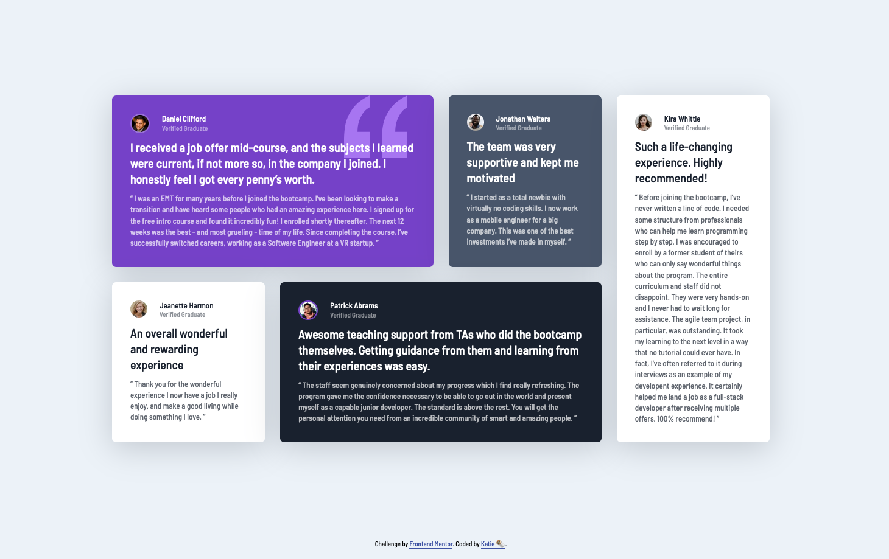

# Frontend Mentor - Testimonials grid section solution

This is my solution to the [Testimonials grid section challenge on Frontend Mentor](https://www.frontendmentor.io/challenges/testimonials-grid-section-Nnw6J7Un7). Frontend Mentor challenges help you improve your coding skills by building realistic projects.

## Contents

- [Screenshot](#screenshot)
- [Built with](#built-with)
- [What I learned](#what-i-learned)
- [Continued development](#continued-development)
- [Useful resources](#useful-resources)
- [Author](#author)
- [Acknowledgments](#acknowledgments)

### Screenshot

<!--  -->



### Built with

- Semantic HTML5 markup
- CSS custom properties
- Flexbox
- CSS Grid
- Scss
- Mobile-first workflow

### What I learned

This was my first time trying a mobile-first approach as well as my first non-tutorial Sass project. I started with a single column grid for the layout because I knew I wanted the final desktop layout to be a grid (based on the project name and the two dimensional design), but realized that the middle screen sizes between the assigned desktop of 1440px and the assigned mobile of 375px would be better displayed with a flexbox layout. At first, I was able to achieve something similar using grid, but opted for flexbox, as it was a simpler and more efficient solution. Then, on the larger screens, I just changed the display from flexbox to grid, to achieve the more structured grid layout for the desktop view.

My initial layout idea, starting with grid, and also testing my understanding of auto-fit and minmax:

```css
.section__testimonials {
  display: grid;
  grid-template-columns: repeat(auto-fit, minmax(30rem, 1fr));
}

.testimonial {
  @media only screen and (min-width: 43em) {
    &:last-child {
      grid-column: 1 / -1;
      justify-self: center;
      width: 50%;
    }
  }
}
```

What I opted for instead, using flexbox on the smaller screens, and then switching to grid for larger:

```css
.section__testimonials {
  display: flex;
  flex-wrap: wrap;
  justify-content: center;

  @media only screen and (min-width: 62.5em) {
    & {
      display: grid;
      grid-template-columns: repeat(4, 1fr);
    }
  }
}
```

### Continued development

- I struggled to determine where to place responsive breakpoints between the mobile and the large screen and how to lay out the cards, so I still need to practice this more.
- Deciding how best to semantically break up the html (which tags to assign to the different elements) was also a bit of a challenge.
- I want to test making the grid layout repeatable, so that it can easily adapt if more testimonials are added.
- I attempted to make the cards more flexible with generic class names and using nth-child pseudo classes a lot. I'm not sure this is the best approach as it makes the css a bit harder to read, but it was good practice to reinforce my understanding of the pseudo class instead of custom classes assigned to each card.

### Useful resources

- I used sass to build this project after completing Jonas Schmedtmann's [Advanced CSS and Sass Udemy Course](https://www.udemy.com/course/advanced-css-and-sass/)
- I also relied a lot on the [MDN](https://developer.mozilla.org/en-US/) and [Sass](https://sass-lang.com/documentation/) documentation for reference and understanding.

## Author

- Katie B
- Frontend Mentor - [@KatieB4](https://www.frontendmentor.io/profile/KatieB4)
